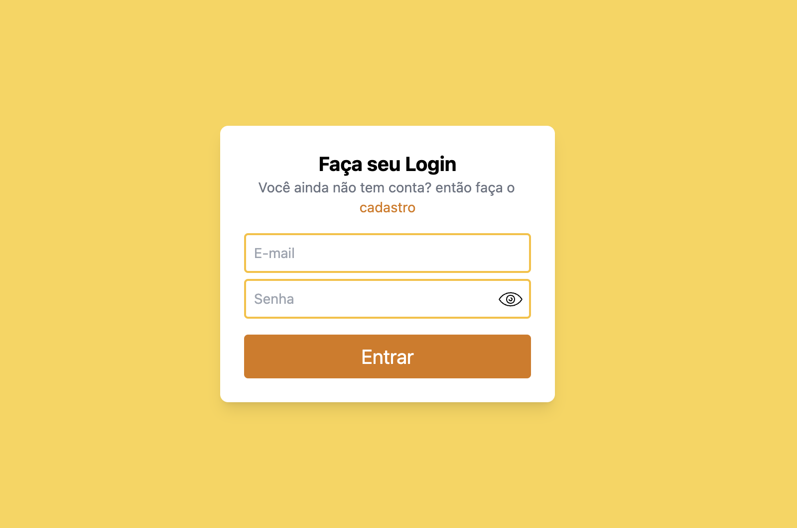

<h1 align="center">
   Signin Signout Project
</h1>

<p align="center">
<a href="#-instructions">Instructions</a>&nbsp;&nbsp;&nbsp;|&nbsp;&nbsp;&nbsp;
  <a href="#-technologies">Technologies</a>&nbsp;&nbsp;&nbsp;|&nbsp;&nbsp;&nbsp;
  <a href="#-project">Project</a>&nbsp;&nbsp;&nbsp;|&nbsp;&nbsp;&nbsp;
  <a href="#-licença">Licence</a>
</p>

<p align="center">
 

  
</p>

<br>

<p align="center">
  
</p>

## 📖 Instructions

* Step 1

```bash
run yarn 
```

* step 2

```bash
insert  the api address as it is in the .env.example
```

Note: if you are interested in using the API that I already created, just clone this repository
[API](https://github.com/lfeliperibeiro/nestjs-rest-course)

## 🚀 technologies

This project was developed with the following technologies:

- [React](https://reactjs.org)
- [Vite](https://vitejs.dev/)
- [TypeScript](https://www.typescriptlang.org/)
- [tailwind](https://tailwindcss.com/)
- [jest](https://jestjs.io/)
- [testing-library](https://testing-library.com/)

## 💻 project

This is a login application using best practices on the front end. It is using token authentication and also working out all the accessibility details


## Licence

This project is under the MIT license. See the file [LICENSE](LICENSE.md) for more details.

---

Made with ♥ by Felipe Ribeiro